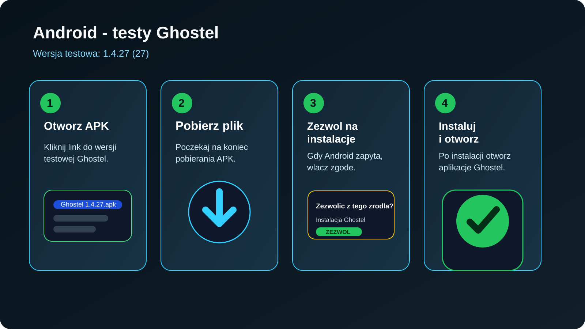
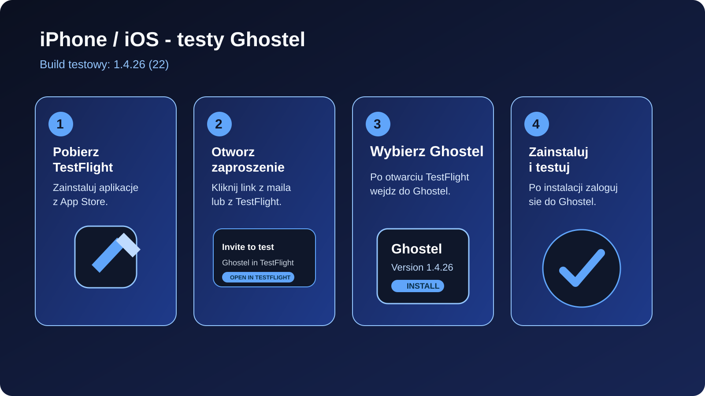

# Ghostel - instrukcja dla testerów

Ta instrukcja opisuje, jak dołączyć do testów aplikacji Ghostel na Androidzie i iPhonie.

## Aktualna wersja testowa

- Android APK `1.4.26 (26)`:
  `https://api.ghostel.app/app-release.apk`
- iOS `1.4.26 (22)`:
  instalacja tylko przez `TestFlight` po otrzymaniu zaproszenia albo publicznego linku TestFlight

## Android



### Jak dołączyć do testów na Androidzie

1. Otwórz na telefonie link do pliku APK.
2. Pobierz plik `Ghostel 1.4.26`.
3. Jeśli telefon zapyta o instalację z nieznanego źródła, wybierz:
   `Ustawienia` -> `Zezwól z tego źródła`.
4. Wróć do pobranego pliku i wybierz `Instaluj`.
5. Po instalacji otwórz aplikację i zaloguj się na swoje konto testowe.

### Jeśli instalacja jest zablokowana

- Samsung / Android 13+:
  `Ustawienia` -> `Bezpieczeństwo i prywatność` -> `Instaluj nieznane aplikacje`
- Xiaomi / Motorola / Pixel:
  system zwykle pokaże okno z prośbą o jednorazowe zezwolenie
- Jeśli pojawia się komunikat `Aplikacja nie została zainstalowana`:
  najpierw usuń z telefonu wcześniejszą wersję `Ghostel`, a potem zainstaluj nowe APK jeszcze raz.
  Ten błąd najczęściej oznacza konflikt podpisu albo poprzedniej instalacji, a nie uszkodzony link.

### Co tester powinien sprawdzić na Androidzie

- logowanie i wylogowanie
- powiadomienia push
- połączenia głosowe po zablokowaniu i odblokowaniu ekranu
- czy po wylogowaniu telefon nie dzwoni już na stare konto

## iPhone / iOS



### Jak dołączyć do testów na iPhonie

1. Zainstaluj aplikację `TestFlight` z App Store.
2. Otwórz zaproszenie do testów, które przyjdzie mailem albo jako publiczny link TestFlight.
3. Kliknij `View in TestFlight` albo `Start Testing`.
4. W TestFlight wybierz aplikację `Ghostel`.
5. Kliknij `Install`.
6. Po instalacji otwórz aplikację i zaloguj się na swoje konto testowe.

### Ważne

- Na iOS tester **nie instaluje** aplikacji z pliku `.ipa` bezpośrednio.
- Tester dołącza przez `TestFlight`.
- Link do strony builda w Expo **nie jest** linkiem instalacyjnym dla testera i nie zastępuje zaproszenia TestFlight.
- Jeśli nie masz zaproszenia, administrator testów musi dodać Twój adres e-mail w App Store Connect / TestFlight albo wysłać publiczny link TestFlight.

### Co tester powinien sprawdzić na iOS

- czy przychodzi powiadomienie o połączeniu
- czy połączenie trwa dalej po odblokowaniu ekranu
- czy po wylogowaniu i zalogowaniu na inne konto iPhone nie odbiera połączeń na stare konto
- dźwięk rozmowy i stabilność połączenia między iOS a Androidem

## Jak zgłaszać problem

Przy zgłaszaniu błędu tester powinien od razu podać:

1. model telefonu
2. wersję systemu
3. numer wersji aplikacji `1.4.26`
4. dokładny opis, co zrobił krok po kroku
5. screen albo nagranie ekranu, jeśli to możliwe

## Krótka wiadomość do wysłania testerowi

Skopiuj i wyślij:

```text
Cześć, poniżej masz instrukcję do testów Ghostel.

Android:
Pobierz i zainstaluj APK:
https://api.ghostel.app/app-release.apk

Jeśli telefon pokaże "Aplikacja nie została zainstalowana", usuń wcześniejszą wersję Ghostel i spróbuj ponownie.

iPhone:
Najpierw zainstaluj TestFlight z App Store, a potem otwórz zaproszenie do testów albo publiczny link TestFlight, który od nas dostaniesz.

Po instalacji sprawdź proszę:
- logowanie
- powiadomienia
- połączenia głosowe
- zachowanie aplikacji po zablokowaniu i odblokowaniu ekranu

Jeśli coś nie działa, wyślij model telefonu, wersję systemu i krótki opis problemu.
```
